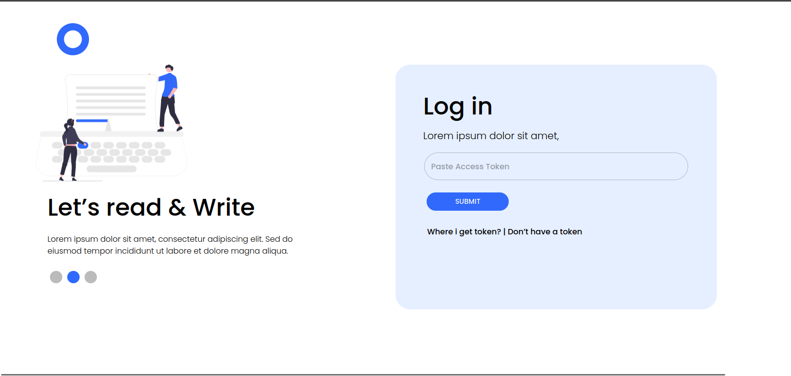

# HashHive 🚀

HashHive is a dynamic and modern blog website developed as part of the Hashnode hackathon. This project brings together the skills and creativity of Ankit, Aman, and Ritik to create a seamless and engaging platform for bloggers.

## Technology Used 💻

- React (Typescript) : A powerful JavaScript library for building user interfaces. The entire website is built on React components, providing a modular and efficient structure.

- Material-UI (MUI) : The UI components of the website are designed using MUI, which offers a set of pre-designed React components following the Material Design principles. This not only enhances the visual appeal but also improves the overall user experience.

- Hashnode (API) : Hashnode API allows developers to interact with the Hashnode blogging platform. It supports features like fetching user and post data, creating new posts, updating user profiles, and managing comments. The API is RESTful, utilizing standard HTTP methods, and requires authentication through API keys. Comprehensive documentation is available to guide developers in integrating Hashnode functionality into their applications.

## Features 🌟

- Responsive Design: The website is designed to be fully responsive, ensuring a consistent and enjoyable experience across various devices and screen sizes.

- Dynamic Content: Blog and other dynamic content are managed through Hashnode API (GraphQL), providing a flexible and scalable solution for updating and adding new content.

- Interactive UI: Leveraging the capabilities of React, the website features an interactive and dynamic user interface, making the user experience engaging and enjoyable.

## Website look like this 🖼️




## Run Locally 

Clone the project

```bash
  git@github.com:squad-a/HashHive.git
```

Install dependencies

```bash
  npm install
```

Start Development Server

```bash
  npm run dev
```

Paste you URI in .env file

## 🚀 Contributor

- **Aman**
  - GitHub: [Aman's GitHub](https://github.com/elamandeep)

- **Ankit**
  - GitHub: [Ankit's GitHub](https://github.com/ankitbisen28)

- **Ritik**
  - GitHub: [Ritik's GitHub](https://github.com/Ritikphenomenon)
  
- **Durgesh (UI Designer)**
  - Website: [Durgesh's Website](https://durgesh.website/)

## Acknowledgments 🙏

We would like to express our gratitude to the following individuals and organizations who have contributed to the success of HashHive:

- **Hashnode Team**: We appreciate the Hashnode team for organizing the hackathon and providing a platform for developers to showcase their skills and creativity.

- **Open Source Community**: A big thank you to the wider open-source community for the valuable resources, libraries, and support that helped make HashHive possible.

- **MUI (Material-UI) Community**: Special thanks to the Material-UI community for creating an excellent React UI framework that significantly enhanced the visual appeal and functionality of HashHive.

- **Reactjs Community**: The Reactjs community's continuous innovation and collaborative spirit have played a crucial role in the development of HashHive.

- **Contributors**: A heartfelt thank you to our contributors - Ankit, Aman, and Ritik, Durgesh for their dedication, time, and effort in building and improving HashHive.

We are grateful for the inspiration, guidance, and support from everyone involved in this project. HashHive wouldn't be the same without your collective contributions.

---